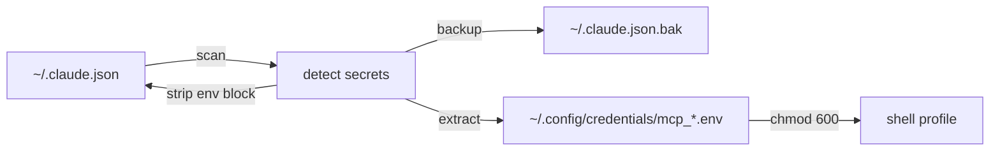

<!--
SEO Keywords: claude code, mcp, model context protocol, security scanner, hardcoded tokens,
api key leak, credentials, anthropic, devsecops, pre-commit, ~/.claude.json,
italian ai, astra digital, polpo squad
SEO Description: Security scanner for Claude Code MCP configs. Finds hardcoded tokens in ~/.claude.json before they leak. 15+ patterns, one-command fix.
Author: Mattia Calastri
Location: Verona, Italy
-->

<div align="center">

# 🐙 mcp-audit

### Security scanner for Claude Code MCP configs.

Finds hardcoded API keys in `~/.claude.json` and migrates them safely.

[](./LICENSE)
[](https://github.com/mattiacalastri/mcp-audit/stargazers)
[](https://github.com/mattiacalastri/mcp-audit/issues)
[](https://github.com/mattiacalastri/mcp-audit/commits)
[](https://mattiacalastri.com)

</div>

---

## ✨ Why

> *"I found 8 hardcoded tokens in my Claude Code config after 873 sessions."*

The official Claude Code MCP setup docs show:

```json
{ "env": { "API_KEY": "sk-your-real-token-here" } }
```

No warning. No alternative. So 75%+ of advanced users have real tokens sitting in a plain JSON file, sometimes with `644` permissions.

`~/.claude.json` is not code — people don't treat it like a secret. **But it is.**

```
🔴 CRITICAL  github          GITHUB_TOKEN          ghp_ChJx······4GTfUS  GitHub Personal Access Token
🔴 CRITICAL  supabase-bot    SUPABASE_ACCESS_TOKEN  sbp_4a58······1c89    Supabase Access Token
🔵 MEDIUM    file-perms      ~/.claude.json is 644 — should be 600

  2 CRITICAL  ·  0 HIGH  ·  1 MEDIUM  ·  0 INFO

  Run `mcp-audit --fix` to migrate tokens to ~/.config/credentials/
```

## 🚀 Quick Start

```bash
pip install mcp-audit
# or
pipx run mcp-audit
```

## 📖 Usage

```bash
# Scan ~/.claude.json and report
mcp-audit

# Preview what --fix would do (no files written)
mcp-audit --fix --dry-run

# Migrate secrets to ~/.config/credentials/ and clean claude.json
mcp-audit --fix

# Hook mode: silent if clean, one warning line if CRITICAL
mcp-audit --watch

# JSON output for scripting
mcp-audit --json

# Scan a specific config
mcp-audit --config ~/other.json
```

## 🔁 SessionStart Hook

Add to `~/.claude/settings.json` to get a silent security check every session:

```json
{
  "hooks": {
    "SessionStart": [
      {
        "matcher": "",
        "hooks": [
          {
            "type": "command",
            "command": "mcp-audit --watch"
          }
        ]
      }
    ]
  }
}
```

Silent if everything is clean. One line warning if it finds a CRITICAL token.

## 🎯 What it detects

| Provider     | Pattern type              | Severity |
|-------------|---------------------------|----------|
| GitHub      | PAT, Fine-Grained, OAuth  | 🔴 CRITICAL |
| Anthropic   | API Key                   | 🔴 CRITICAL |
| OpenAI      | API Key                   | 🔴 CRITICAL |
| Telegram    | Bot Token                 | 🔴 CRITICAL |
| Supabase    | Access Token, JWT         | 🔴 CRITICAL / HIGH |
| Stripe      | Secret Key (live/test)    | 🔴 CRITICAL / HIGH |
| AWS         | Access Key ID             | 🔴 CRITICAL |
| Google      | API Key                   | 🔴 CRITICAL |
| Slack       | Bot / User Token          | 🔴 CRITICAL |
| ElevenLabs  | API Key                   | 🔴 CRITICAL |
| HuggingFace | API Token                 | 🔴 CRITICAL |
| Replicate   | API Token                 | 🔴 CRITICAL |
| fal.ai      | API Key                   | 🔴 CRITICAL |
| n8n         | API Key                   | 🔴 CRITICAL |
| File perms  | ~/.claude.json not 600    | 🔵 MEDIUM   |

## 🏗️ How `--fix` works



1. Extracts each hardcoded secret from the MCP server `env` block
2. Writes it to `~/.config/credentials/mcp_{server}.env` (chmod 600)
3. Removes the key from `~/.claude.json` (backs up first)
4. Prints the `source` commands to add to your shell profile

Your MCP servers will then inherit the env vars from your shell — no secrets in JSON.

## 🛠️ Tech Stack


## 🤝 Contributing

PRs welcome for new secret patterns. Open an issue first for major changes.

## 📄 License

MIT — Mattia Calastri / Astra Digital

## 🔗 Links

- 🌐 [mattiacalastri.com](https://mattiacalastri.com) · [digitalastra.it](https://digitalastra.it)
- 🐙 [Polpo Supremo](https://github.com/mattiacalastri/polpo-supremo) — 9-arm AI agent toolkit
- 🔨 [AI Forging Kit](https://github.com/mattiacalastri/AI-Forging-Kit) — the method behind the tools

---

<div align="center">

**Built with 🐙 by [Mattia Calastri](https://mattiacalastri.com) · [Astra Digital Marketing](https://digitalastra.it)**

*AI for humans, not for hype*

</div>
